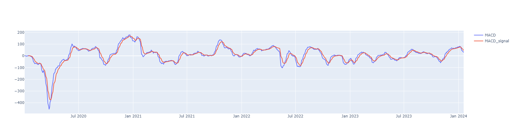

# Stock Forecasting and Analysis using LSTM

## Overview

This project aims to forecast and analyze stock prices using Long Short-Term Memory (LSTM) networks. It utilizes historical stock data from the IDX Composite Index to train a model capable of predicting future price trends.

## Installation

To set up the required environment, follow these steps:

1. Clone this repository:

```bash
git clone https://github.com/AJustiago/Stock-Market-Analysis-And-Forecasting.git
```

2. Install dependencies:

```bash
pip install -r requirements.txt
Gunakan kode dengan hati-hati. Pelajari lebih lanjut
```
## Dataset

historical stock data from https://id.investing.com/indices/idx-composite-historical-data

## Stock Analytics

1. Candlestick


2. EMA


3. MACD



4. RSI


5. SMA


6. SMA & EMA


## Result

Chart Candlestick Prediction

